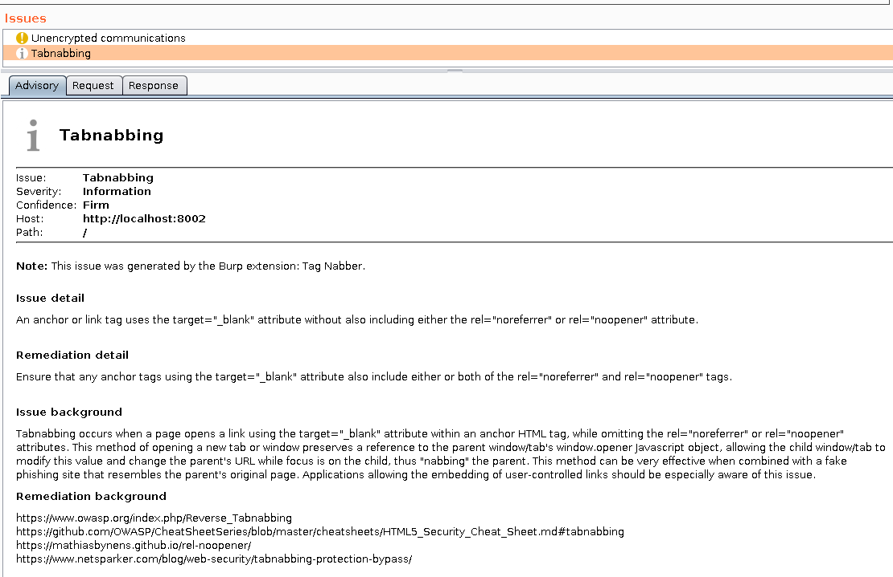

# Tag Nabber

A Burp Suite extension for identifying anchor tags and other potential sources of Tabnabbing.

* Passive scanner checks create informational issues in Burp Suite
* Written in Python
* Requires Jython 2.7+
* Pull requests welcome!

### Todo

* Add regex for window.open

### Screenshots

